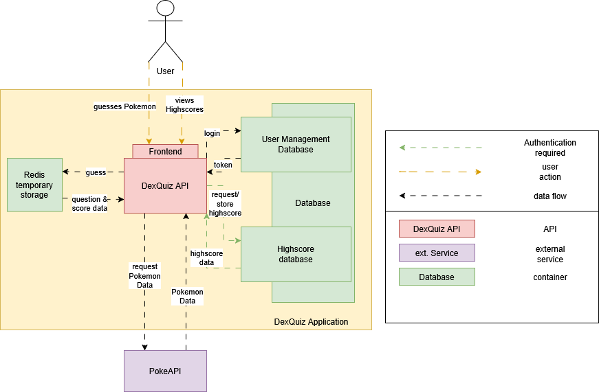

**About arc42**

arc42, the template for documentation of software and system
architecture.

Template Version 8.2 EN. (based upon AsciiDoc version), January 2023

Created, maintained and © by Dr. Peter Hruschka, Dr. Gernot Starke and
contributors. See https://arc42.org.

.. _section-introduction-and-goals:

Introduction and Goals
======================

DexQuiz is an application that lets the user participate in a quiz about the different
species of pokemon. Registered users will also have the opportunity to post their own scores and view 
the highest scores ever achieved on the page.

.. _`_requirements_overview`:

Requirements Overview
---------------------

.. list-table:: Requirements
   :header-rows: 1
   :widths: 5 95

   * - Requirement
     - Description
   * - 1
     - The user can access the quiz even if he is not logged in.
   * - 2
     - The user can register a new account with secure credentials.
   * - 3
     - The user can log in using credentials entered during registration.
   * - 4
     - The user can log out at any time using a button.
   * - 5
     - The user cannot access the highscores if he is not logged in.
   * - 6
     - The user can view the highscore table if he is logged in.
   * - 7
     - The user can participate in the quiz even if he is not logged in.
   * - 8
     - The user can start the quiz when pressing a button.
   * - 9
     - The user can make a guess using a text input.
   * - 10
     - The user will receive feedback whether his guess was correct or not.
   * - 11
     - If the guess was correct, a new question will be generated.
   * - 12
     - If the guess was not correct, the user has the opportunity to give another answer.
   * - 13
     - The highscore and user data will be stored using a database.

.. _`_quality_goals`:

Quality Goals
-------------

The quality of this project is assured using codacy.

The quality goals are set as follows (in accordance with the project requirements):

- Minimum test coverage: **80%**, achieved by implementing the following types of tests:
  - Unit tests
  - Integration tests
  - API tests
  - e2e tests
- Maximum code duplication: **10%** (measures in SLoC, only code blocks are considered)
- Low code complexity
- Maximum **0 issues** (code smells) per 1000 SLoC

.. _`_stakeholders`:

Stakeholders
------------

Theres only me who wants to pass this course and my professor who sets the requirements for this course. But for the sake of this project, theres also the user who wants to
play the quiz (differentiating between the 'regular user' and the 'logged in user' who want to play the quiz and compete on the highscore leaderboard respectively)

.. _section-architecture-constraints:

Architecture Constraints
========================

DexQuiz shall be:

- platform-independent and be able to run on Windows, Linux and MacOS
- completely dockerized (including the database)
- executable by running a maximum of 2 terminal commands (excluding git clone operations)
- accessable using a chromium-based browser or Firefox (frontend only, backend is excluded from this)
- developed under a liberal license

.. _section-context-and-scope:

Context and Scope
=================

.. _`_business_context`:

Business Context
----------------

**<Diagram or Table>**

.. _`_technical_context`:

Technical Context
-----------------

The following diagram shows the different services and connections between external and internal services from
a mostly technical point of view.

All communication between the frontend and the backend are using HTTP calls.
The connection to the  PokeAPI is implemented using the PokeBase wrapper for Python.
It most likely uses HTTP calls internally to fetch the data from the PokeAPI.

.. _section-solution-strategy:

Solution Strategy
=================

1. Implement the DexQuiz Application in the Python programming language using FastAPI framework to build the frontend and backend
   API.

2. To define the Frontend, Jinja2Templates are used which use html templates + CSS + JS (for accessing the backend API and do some frontend magic).

3. In order to persist user data, a MySQL database is used containing two different tables for storing information:

   - a User table dealing with authentication (storing a Unique User ID, Username and a hashed password.
   - a Highscore table storing User highscores.

4. Dependency management is done via a requirements.txt file (according to python conventions).

5. For configuration of the DexQuiz Application, environment variables are used. If no .env file is provided, the default values are used. A sample
   .env file is provided for custom configuration.

.. _section-building-block-view:

Building Block View
===================

.. _`_whitebox_overall_system`:

Whitebox Overall System
-----------------------

Motivation
   The structure separates frontend, backend, and persistence concerns to 
   support modularity and separation of concerns. This architecture also 
   enables independent testing and development of individual components 
   and facilitates future scaling.

Contained Building Blocks
   - Frontend: Provides the user interface via Jinja2 templates and JavaScript.
   - Backend: Implements FastAPI endpoints and business logic.

Important Interfaces
   - HTTP REST interface between frontend and backend
   - Internal service functions between backend and auth/database modules
   - SQL-based data access between backend and MySQL
   - Token-based authentication via OAuth2 Bearer scheme

.. _`__name_black_box_1`:

Backend (FastAPI)
~~~~~~~~~~~~~~~~~~

*Purpose/Responsibility*

Handles REST endpoints, business logic, routing, error handling, and coordination of services.

*Interface(s)*

- Exposes HTTP API routes (e.g. `/api/register`, `/api/token`, `/api/highscores`)
- Calls functions from `auth_service` and `database_service`

*Quality/Performance Characteristics*

- Asynchronous support for concurrent handling
- Uses connection pooling for efficient DB access

*Directory/File Location*

- `app/main.py`
- `app/routes/`

.. _`__name_black_box_2`:

Frontend (Jinja2 + JS)
~~~~~~~~~~~~~~~~~~~~~~~

*Purpose/Responsibility*

Renders user-facing pages using Jinja2 templates and JavaScript.

*Interface(s)*

- Interacts with FastAPI via form submissions (Guess and login/registration)
- Handles user input and displays quiz/game UI

*Directory/File Location*

- `app/templates/`
- `app/static/`

White Box Backend
~~~~~~~~~~~~~~~~~~~~~~~~~~~~~~

*<white box template>*

.. _`_white_box_emphasis_building_block_2_emphasis`:

White Box *<building block 2>*
~~~~~~~~~~~~~~~~~~~~~~~~~~~~~~

…

.. _`_white_box_emphasis_building_block_m_emphasis`:

Whitebox Overall System
-----------------------

.. image:: images/block_level_1.png
   :alt: Level 1 DexQuiz Architecture Diagram
   :width: 1200px
   :align: center

Motivation
   This architecture separates concerns into well-defined components to support scalability, testability, and maintainability. The backend acts as a mediator between the frontend and the persistence layer. Each component is isolated and independently testable, supporting CI/CD workflows and fast iteration.

Contained Building Blocks
   - **Frontend**: A Jinja2/JavaScript-based interface rendered by the backend. Sends form data and receives JSON or rendered HTML.
   - **Backend (FastAPI)**: Core of the application. Implements routing, business logic, and connects to auth/database services. 
   - **Auth Service**: Stateless component that handles password validation, JWT creation and decoding.
   - **Database Service**: Handles all MySQL communication (user and highscore data).
   - **MySQL Database**: Stores user data and highscores persistently.

Important Interfaces
   - **HTTP (REST)**: Between frontend and backend (e.g., registration, login, quiz)
   - **Function Calls**: Between backend and services (`auth_service`, `database_service`)
   - **SQL**: Between database service and MySQL
   - **OAuth2 (JWT Bearer Tokens)**: Used to secure protected routes (e.g., /api/highscores)

.. _`__backend`:

Backend (FastAPI)
~~~~~~~~~~~~~~~~~

*Purpose/Responsibility*

   Coordinates all incoming requests, performs business logic, and returns responses. Delegates authentication and database logic to service modules.

*Interfaces*

   - Exposes REST endpoints (`/api/register`, `/api/token`, `/api/highscore`)
   - Depends on Auth and DB services for internal logic

*Directory/File Location*

   - `app/main.py`
   - `app/routes/`

.. _`__auth_service`:

Auth Service
~~~~~~~~~~~~

*Purpose/Responsibility*

   Handles user registration checks, password hashing and verification, and JWT token handling.

*Interfaces*

   - `register_user()`
   - `authenticate_user()`
   - `create_access_token()`
   - `get_user_from_token()`

*Directory/File Location*

   - `app/services/auth_service.py`

.. _`__database_service`:

Database Service
~~~~~~~~~~~~~~~~

*Purpose/Responsibility*

   Handles database reads and writes for user and highscore entities.

*Interfaces*

   - `get_user()`
   - `add_highscore()`
   - `get_highscores()`

*Directory/File Location*

   - `app/services/database_service.py`

.. _`__frontend`:

Frontend (Jinja2 + JS)
~~~~~~~~~~~~~~~~~~~~~~

*Purpose/Responsibility*

   Renders web pages using Jinja2 templates and JavaScript. Sends data to the backend and displays quiz/game logic in the browser.

*Interfaces*

   - Calls backend routes via HTTP or form submissions

*Directory/File Location*

   - `app/templates/`
   - `app/static/`

.. _`__mysql_database`:

MySQL Database
~~~~~~~~~~~~~~

*Purpose/Responsibility*

   Stores user and highscore data persistently.

*Interfaces*

   - Accessed via SQL queries from `database_service.py`

*Directory/File Location*

   - External dependency defined via Docker/Testcontainers

Level 3
-------

.. _`_white_box_building_block_x_1`:

Authentication Service (auth_service)
~~~~~~~~~~~~~~~~~~~~~~~~~~~~~~~~~~~~~

.. image:: images/auth_service.png
   :alt: Authentication Service Class diagram
   :width: 1200px
   :align: center

.. _`_white_box_building_block_x_2`:

Database Service (database_service)
~~~~~~~~~~~~~~~~~~~~~~~~~~~~~~~~~~~

.. image:: images/database_service.png
   :alt: Database Service Class diagram
   :width: 1200px
   :align: center

**Purpose/Responsibility**

   Provides database connectivity (via MySQL and pooling), and implements all data persistence and retrieval logic for users and highscores.

**Contained Building Blocks**

   - `get_pool`: Initializes a MySQL connection pool (singleton).
   - `connect_to_db`: Legacy connection logic for custom DB setups.
   - `get_connection`: Gets a pooled connection (default port from env).
   - `add_user`, `get_user`, `delete_user`: CRUD for user data.
   - `add_highscore`, `get_highscores`, `get_user_highscores`, `get_top_highscores`: CRUD for highscore data.

**Important Interfaces**

   - **MySQLConnectionPool (mysql.connector.pooling)**: Used to maintain a reusable DB connection pool.
   - **Connector/Cursor Interface**: For executing raw SQL queries.
   - **Environment Variables (.env)**: Controls DB config.
   - **Logger**: Used for error tracking.

**Quality/Performance Characteristics**

   - Uses connection pooling for improved performance.
   - Structured error handling with rollback and detailed logging.
   - Retry logic in legacy connection improves reliability.

**Directory/File Location**

   - `app/services/database_service.py`

**Fulfilled Requirements**

   - User registration, deletion, authentication support.
   - Highscore submission and leaderboard retrieval.

**Open Issues/Risks**

   - Some exception handling is broad (e.g., bare `except Exception`).
   - Potential for cursor leakage if `cursor.close()` is missed on error.

.. _`_white_box_building_block_y_1`:

Pokemon Service (pokemon_service)
~~~~~~~~~~~~~~~~~~~~~~~~~~~~~~~~~

.. image:: images/pokemon_service.png
   :alt: Pokemon Service Class diagram
   :width: 1200px
   :align: center

**Purpose/Responsibility**

   Provides functionality to fetch and format Pokémon data using the external PokeBase library. Acts as the logic layer for quiz-related Pokémon content.

**Contained Building Blocks**

   - `get_random_pokemon_id`: Returns a random Pokémon ID within a defined range.
   - `get_english_dex_entry`: Selects a random English Pokédex entry.
   - `extract_stats`: Extracts and formats Pokémon base stats.
   - `extract_types`: Extracts and formats Pokémon type(s).
   - `log_pokemon_details`: Logs selected Pokémon attributes.
   - `fetch_pokemon`: Central function to fetch and return Pokémon data encapsulated as `QuizInfo`.

**Important Interfaces**

   - **PokeBase API (pokebase)**: Used to retrieve structured Pokémon data.
   - **QuizInfo (domain model)**: Return type of `fetch_pokemon`, used in the quiz.
   - **Logger (custom utility)**: Logs Pokémon details for debugging and traceability.
   - **Environment Variable `POKEMON_CACHE`**: Used to configure pokebase caching.

**Quality/Performance Characteristics**

   - Efficient data access via local PokeBase cache.
   - Isolated logging and transformation logic supports reuse and testability.

**Directory/File Location**

   - `app/services/pokemon_service.py`

**Fulfilled Requirements**

   - Pokémon quiz question generation.
   - Random Pokémon selection and presentation.
   - Includes English descriptions and base stats for game logic.

**Open Issues/Risks**

   - Depends on the availability and stability of the PokeBase API and cache.
   - Error handling is minimal—assumes valid data from PokeBase.

.. _section-runtime-view:

Runtime View
============

.. _`__runtime_scenario_1`:

Login-Registration
------------------

The following sequence diagram shows the workflow through the DexQuiz Application when
registering a new user and logging in with user credentials.

.. image:: images/login_register_sequence.png
   :alt: login_register_sequence_diagram
   :width: 1200px
   :align: center

-  The information whether a client is logged in or not is done via putting the token into the local storage.
   I know its not ideal, but i feel like its suitable for this project. Ideally it should be stored in cookies.
-  During the registration process, it is checked whether the username is longer than 5 characters
-  During the registration process, it is checked whether the password is longer than 8 characters

.. _`__runtime_scenario_2`:

Quiz-Highscore Sequence
-----------------------

The following sequence diagram shows the quiz workflow with a logged in user choosing
to store their achieved score to the highscore board.

.. image:: images/quiz_highscore_sequence.png
   :alt: login_register_sequence_diagram
   :width: 1200px
   :align: center

-  Pokebase is used in order to fetch the data from the PokeAPI. in the Pokemon_service the data relevant for the
   quiz is then extracted from the API response
-  A highscore can only be submitted when the user is logged in (i.e. no valid token is found in the local storage)
   If that is detected, the user will be notified or the POST request will not return a status code 200.

.. _section-deployment-view:

Deployment View
===============

.. _`_infrastructure_level_1`:

Infrastructure Level 1
----------------------

**<Overview Diagram>**

Motivation
   *<explanation in text form>*

Quality and/or Performance Features
   *<explanation in text form>*

Mapping of Building Blocks to Infrastructure
   *<description of the mapping>*

.. _`_infrastructure_level_2`:

Infrastructure Level 2
----------------------

.. _`__emphasis_infrastructure_element_1_emphasis`:

*<Infrastructure Element 1>*
~~~~~~~~~~~~~~~~~~~~~~~~~~~~

*<diagram + explanation>*

.. _`__emphasis_infrastructure_element_2_emphasis`:

*<Infrastructure Element 2>*
~~~~~~~~~~~~~~~~~~~~~~~~~~~~

*<diagram + explanation>*

…

.. _`__emphasis_infrastructure_element_n_emphasis`:

*<Infrastructure Element n>*
~~~~~~~~~~~~~~~~~~~~~~~~~~~~

*<diagram + explanation>*

.. _section-concepts:

Cross-cutting Concepts
======================

.. _`__emphasis_concept_1_emphasis`:

*<Concept 1>*
-------------

*<explanation>*

.. _`__emphasis_concept_2_emphasis`:

*<Concept 2>*
-------------

*<explanation>*

…

.. _`__emphasis_concept_n_emphasis`:

*<Concept n>*
-------------

*<explanation>*

.. _section-design-decisions:

Architecture Decisions
======================

See ADRs in ADR section of this documentation.

.. _section-quality-scenarios:

Quality Requirements
====================

.. _`_quality_tree`:

Quality Tree
------------

.. _`_quality_scenarios`:

Quality Scenarios
-----------------

.. _section-technical-risks:

Risks and Technical Debts
=========================

- Missing HTTPS means all http requests are unencrypted.
- Lack of asyncronous db handling means the application may perform poorly and error-ridden under high load.

.. _section-glossary:

Glossary
========

+-----------------------+-----------------------------------------------+
| Term                  | Definition                                    |
+=======================+===============================================+
| *<Term-1>*            | *<definition-1>*                              |
+-----------------------+-----------------------------------------------+
| *<Term-2>*            | *<definition-2>*                              |
+-----------------------+-----------------------------------------------+

.. |arc42| image:: images/arc42-logo.png
