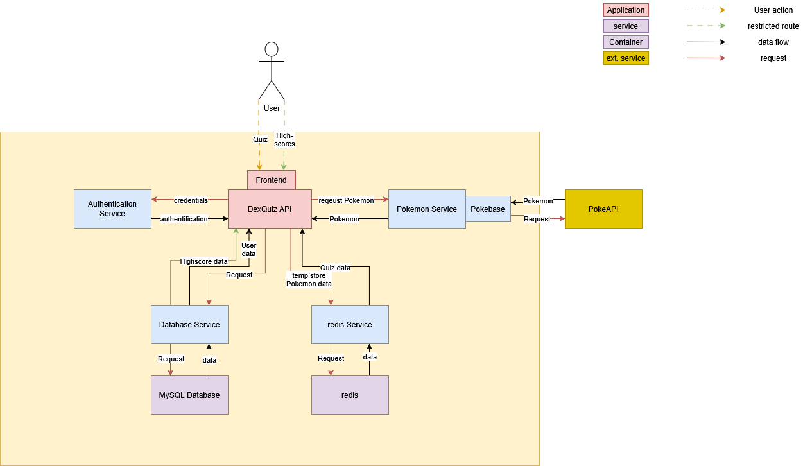
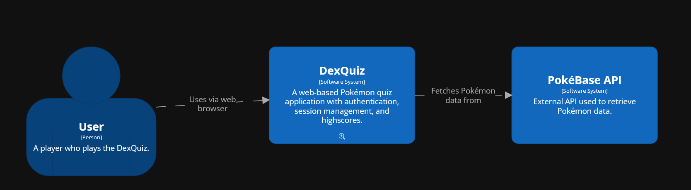
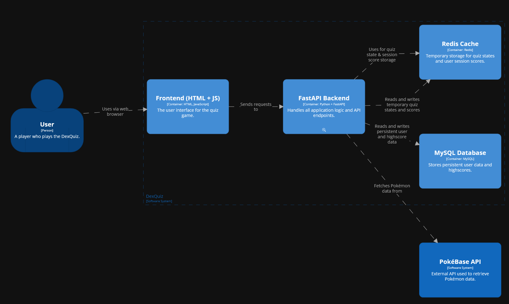
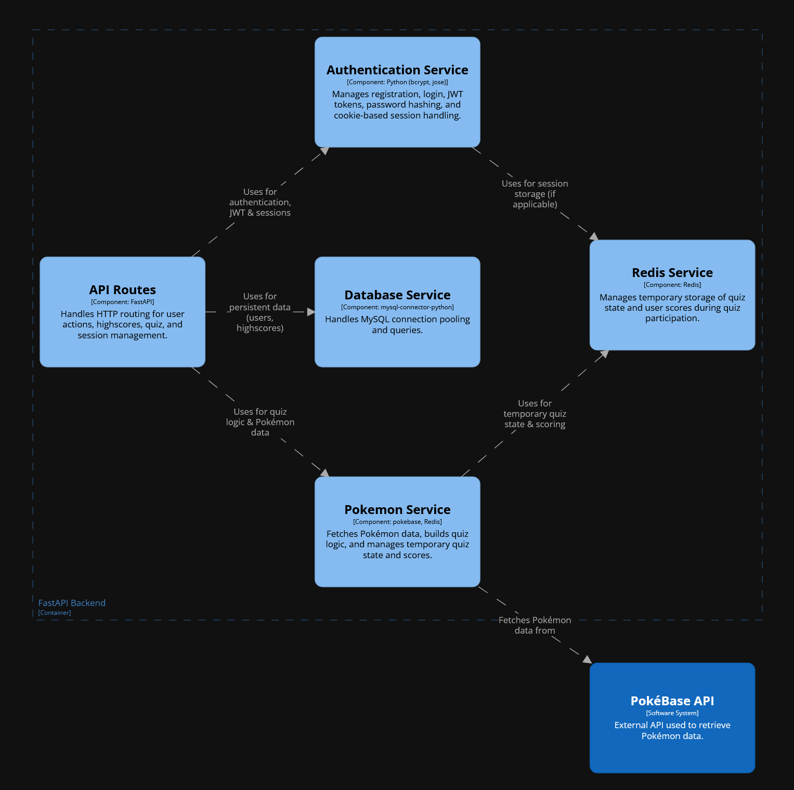
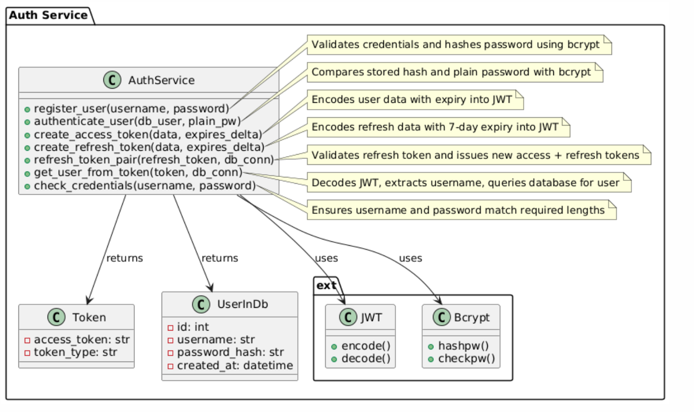
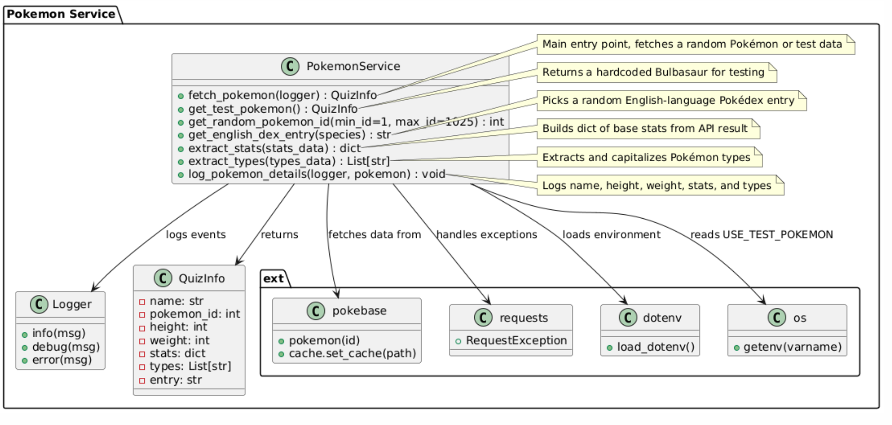
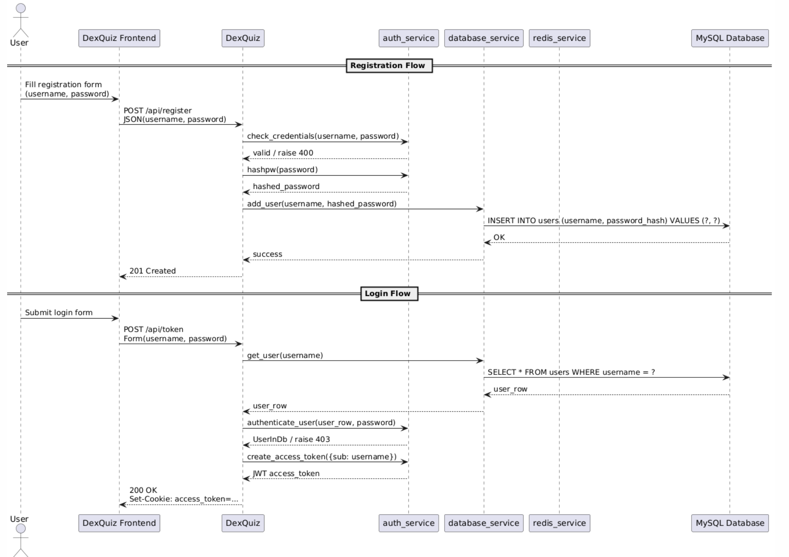

**About arc42**

arc42, the template for documentation of software and system
architecture.

Template Version 8.2 EN. (based upon AsciiDoc version), January 2023

Created, maintained and © by Dr. Peter Hruschka, Dr. Gernot Starke and
contributors. See https://arc42.org.

.. _section-introduction-and-goals:

Introduction and Goals
======================

**If for any reason the images do not render, you can find them in the docs/source/arc42/images folder**

DexQuiz is an application that lets the user participate in a quiz about the different
species of pokemon. Registered users will also have the opportunity to post their own scores and view 
the highest scores ever achieved on the page.

.. _`_requirements_overview`:

Requirements Overview
---------------------

.. list-table:: Requirements
   :header-rows: 1
   :widths: 5 95

   * - Requirement
     - Description
   * - 1
     - The user can access the quiz even if he is not logged in.
   * - 2
     - The user can register a new account with secure credentials.
   * - 3
     - The user can log in using credentials entered during registration.
   * - 4
     - The user can log out at any time using a button.
   * - 5
     - The user cannot access the highscores if he is not logged in.
   * - 6
     - The user can view the highscore table if he is logged in.
   * - 7
     - The user can participate in the quiz even if he is not logged in.
   * - 8
     - The user can start the quiz when pressing a button.
   * - 9
     - The user can make a guess using a text input.
   * - 10
     - The user will receive feedback whether his guess was correct or not.
   * - 11
     - If the guess was correct, a new question will be generated.
   * - 12
     - If the guess was not correct, the user has the opportunity to give another answer.
   * - 13
     - The highscore and user data will be stored using a database.

The application is **explicitly** not designed to be run on a webserver and it is only supported
to run this locally. (see Technical Debt section of this documentation)

.. _`_quality_goals`:

Quality Goals
-------------

The quality of this project is assured using codacy.

The quality goals are set as follows (in accordance with the project requirements):

- Minimum test coverage: **80%**, achieved by implementing the following types of tests:
  - Unit tests
  - Integration tests
  - API tests
  - e2e tests
- Maximum code duplication: **1%** (measures in SLoC, only code blocks are considered)
- Low code complexity
- Maximum **0 issues** (code smells) per 1000 SLoC

Load testing was not performed as per the requirement update.

.. _`_stakeholders`:

Stakeholders
------------

Theres only me who wants to pass this course and my professor who sets the requirements for this course. But for the sake of this project, theres also the user who wants to
play the quiz (differentiating between the 'regular user' and the 'logged in user' who want to play the quiz and compete on the highscore leaderboard respectively)

.. _section-architecture-constraints:

Architecture Constraints
========================

DexQuiz shall be:

- platform-independent and be able to run on Windows, Linux and MacOS
- completely dockerized (including the database)
- executable by running a maximum of 2 terminal commands (excluding git clone operations)
- accessable using a chromium-based browser or Firefox (frontend only, backend is excluded from this)
- developed under a liberal license

.. _section-context-and-scope:

Context and Scope
=================

.. _`_business_context`:

Business Context
----------------

**<Diagram or Table>**

.. image:: images/context_diagram.png
   :alt: DexQuiz architecture diagram
   :width: 700px
   :align: center

.. _`_technical_context`:

Technical Context
-----------------

The following diagram shows the different services and connections between external and internal services from
a mostly technical point of view.

All communication between the frontend and the backend are using HTTP calls.
The connection to the  PokeAPI is implemented using the PokeBase wrapper for Python.
It most likely uses HTTP calls internally to fetch the data from the PokeAPI.

.. _section-solution-strategy:

Solution Strategy
=================

1. Implement the DexQuiz Application in the Python programming language using FastAPI framework to build the frontend and backend
   API.

2. To define the Frontend, Jinja2Templates are used which use html templates + CSS + JS (for accessing the backend API and do some frontend magic).

3. In order to persist user data, a MySQL database is used containing two different tables for storing information:

   - a User table dealing with authentication (storing a Unique User ID, Username and a hashed password.)
   - a Highscore table storing User highscores.

4. Dependency management is done via a requirements.txt file (according to python conventions).

5. For configuration of the DexQuiz Application, environment variables are used. If no .env file is provided, the default values are used. A sample
   .env file is provided for custom configuration.

6. In order to properly authenticate users, cookies are used.

7. In order to store temporary data, Redis is used as a quick and easy storage for more than one quiz session, regardless
   of whether the user is logged in or not.

.. _section-building-block-view:

Building Block View
===================

.. _`_whitebox_overall_system`:

Whitebox Overall System
-----------------------

Motivation
   The structure separates frontend, backend, and persistence concerns to 
   support modularity and separation of concerns. This architecture also 
   enables independent testing and development of individual components 
   and facilitates future scaling.

Contained Building Blocks
   - DexQuiz Application: Provides the user interface an backend routes
   - PokeAPI: Provides Pokemon Data the user is to be quizzed about.

.. _`__name_black_box_1`:

.. _`_white_box_emphasis_building_block_2_emphasis`:

Level 2 (Container View)
~~~~~~~~~~~~~~~~~~~~~~~~~~~~~~

…

Backend (FastAPI)
~~~~~~~~~~~~~~~~~~

*Purpose/Responsibility*

Handles REST endpoints, business logic, routing, error handling, and coordination of services.

*Interface(s)*

   - HTTP REST interface between frontend and backend
   - Internal service functions between backend and auth/database modules
   - SQL-based data access between backend and MySQL
   - Token-based authentication via OAuth2 Bearer scheme, ideally stored as cookies

*Quality/Performance Characteristics*

- Uses connection pooling for efficient DB access

*Directory/File Location*

- `app/main.py`
- `app/routes/`: except `app/routes/frontend.py`.

.. _`__name_black_box_2`:

Frontend (Jinja2 + JS)
~~~~~~~~~~~~~~~~~~~~~~~

*Purpose/Responsibility*

Renders user-facing pages using Jinja2 templates and JavaScript.

*Interface(s)*

- Interacts with FastAPI via form submissions (Guess and login/registration)
- Handles user input and displays quiz/game UI

*Directory/File Location*

- `app/templates/`: Jinja HTML templates
- `app/static/`: JS/CSS components
- `app/routes/frontend.py`: making the frontend availabel.

.. _`_white_box_emphasis_building_block_m_emphasis`:

Whitebox Component View
-----------------------

Motivation
   This architecture separates concerns into well-defined components to support scalability, testability, and maintainability. The backend acts as a mediator between the frontend and the persistence layer. Each component is isolated and independently testable, supporting CI/CD workflows and fast iteration.

Contained Building Blocks
   - **Frontend**: A Jinja2/JavaScript-based interface rendered by the backend. Sends form data and receives JSON or rendered HTML.
   - **Backend (FastAPI)**: Core of the application. Implements routing, business logic, and connects to auth/database services. 
   - **Auth Service**: Stateless component that handles password validation, JWT creation and decoding.
   - **Database Service**: Handles all MySQL communication (user and highscore data).
   - **MySQL Database**: Stores user data and highscores persistently.
   - **Redis Database**: Used as a storage for temporary Quiz data.

Important Interfaces
   - **HTTP (REST)**: Between frontend and backend (e.g., registration, login, quiz)
   - **Function Calls**: Between backend and services (`auth_service`, `database_service`)
   - **SQL**: Between database service and MySQL
   - **OAuth2 (JWT Bearer Tokens)**: Used to secure protected routes (e.g., /api/highscores)

.. _`__backend`:

Backend (FastAPI)
~~~~~~~~~~~~~~~~~

*Purpose/Responsibility*

   Coordinates all incoming requests, performs business logic, and returns responses. Delegates authentication and database logic to service modules.

*Interfaces*

   - Exposes REST endpoints (`/api/register`, `/api/token`, `/api/highscore`)
   - Depends on Auth and DB services for internal logic

*Directory/File Location*

   - `app/main.py`
   - `app/routes/`

.. _`__auth_service`:

Auth Service
~~~~~~~~~~~~

*Purpose/Responsibility*

   Handles user registration checks, password hashing and verification, and JWT token handling. Also includes
   experimental refresh token support

*Functions*

   - `register_user()`
   - `authenticate_user()`
   - `create_access_token()`
   - `create_refresh_token()`
   - `refresh_token_pair()`
   - `get_user_from_token()`
   - `check_credentials()`

*Directory/File Location*

   - `app/services/auth_service.py`

.. _`__database_service`:

Database Service
~~~~~~~~~~~~~~~~

*Purpose/Responsibility*

   Handles database reads and writes for user and highscore entities.

*Interfaces*

   - `get_user()`
   - `add_highscore()`
   - `get_highscores()`

*Directory/File Location*

   - `app/services/database_service.py`

.. _`__frontend`:

Frontend (Jinja2 + JS)
~~~~~~~~~~~~~~~~~~~~~~

*Purpose/Responsibility*

   Renders web pages using Jinja2 templates and JavaScript. Sends data to the backend and displays quiz/game logic in the browser.

*Interfaces*

   - Calls backend routes via HTTP or form submissions

*Directory/File Location*

   - `app/templates/`
   - `app/static/`

.. _`__mysql_database`:

MySQL Database
~~~~~~~~~~~~~~

*Purpose/Responsibility*

   Stores user and highscore data persistently.

*Interfaces*

   - Accessed via SQL queries from `database_service.py`

*Directory/File Location*

   - External dependency defined via Docker/Testcontainers (see docker-compose.yaml)

redis
~~~~~

*Purpose/Responsibility*

   Used as a temporary storage for Quiz questions and the score

*Interfaces*

   - Accessed via connectors from `redis_service.py`

*Directory/File Location*

   - External dependency defined via Docker/Testcontainers (see docker-compose.yaml)

Level 3 - Services
------------------

.. _`_white_box_building_block_x_1`:

Authentication Service (auth_service)
~~~~~~~~~~~~~~~~~~~~~~~~~~~~~~~~~~~~~

**Purpose/Responsibility**

   The authentication service provides the authentication functionality by creating and evaluating tokens the user
   is then identified by. These tokens are stored on the clients device in the form of cookies. The password is then
   hashed and stored in the MySQL database using the Database Service

**Contained Building Blocks**

   - `register_user`: Registers a new user by validating credentials and hashing the password.
   - `authenticate_user`: Authenticates a user by checking the provided password against the stored hash.
   - `create_access_token`: Creates a new access token.
   - `create_refresh_token`: Creates a JWT refresh token with an optional expiration (defaults to 7 days) (experimental).
   - `refresh_token_pair`: Validates a refresh token and issues a new access and refresh token pair.
   - `get_user_from_token`: Parses a JWT access token to extract the user and return user data. Used to display the
   username in the frontend.
   - `check_credentials`: Checks whether the credentials provided are according to the password requirements.

**Important Interfaces**

   - **MySQLConnectionPool (mysql.connector.pooling)**: Used to maintain a reusable DB connection pool.
   - **Connector/Cursor Interface**: For executing raw SQL queries.
   - **Environment Variables (.env)**: Controls DB config.
   - **Logger**: Used for error tracking.

**Quality/Performance Characteristics**

   - Uses connection pooling for improved performance.
   - Structured error handling with rollback and detailed logging.
   - Retry logic in legacy connection improves reliability.

**Directory/File Location**

   - `app/services/database_service.py`

**Fulfilled Requirements**

   - User registration, deletion, authentication support.
   - Highscore submission and leaderboard retrieval.

**Open Issues/Risks**

   - Some exception handling is broad (e.g., bare `except Exception`).
   - Potential for cursor leakage if `cursor.close()` is missed on error.

.. _`_white_box_building_block_x_2`:

Database Service (database_service)
~~~~~~~~~~~~~~~~~~~~~~~~~~~~~~~~~~~

**Purpose/Responsibility**

   Provides database connectivity (via MySQL and pooling), and implements all data persistence and retrieval logic for users and highscores.

**Contained Building Blocks**

   - `get_pool`: Initializes a MySQL connection pool (singleton).
   - `connect_to_db`: Legacy connection logic for custom DB setups.
   - `get_connection`: Gets a pooled connection (default port from env).
   - `add_user`, `get_user`, `delete_user`: CRUD for user data.
   - `add_highscore`, `get_highscores`, `get_user_highscores`, `get_top_highscores`: CRUD for highscore data.

**Important Interfaces**

   - **MySQLConnectionPool (mysql.connector.pooling)**: Used to maintain a reusable DB connection pool.
   - **Connector/Cursor Interface**: For executing raw SQL queries.
   - **Environment Variables (.env)**: Controls DB config.
   - **Logger**: Used for error tracking.

**Quality/Performance Characteristics**

   - Uses connection pooling for improved performance.
   - Structured error handling with rollback and detailed logging.
   - Retry logic in legacy connection improves reliability.

**Directory/File Location**

   - `app/services/database_service.py`

**Fulfilled Requirements**

   - User registration, deletion, authentication support.
   - Highscore submission and leaderboard retrieval.

**Open Issues/Risks**

   - Some exception handling is broad (e.g., bare `except Exception`).
   - Potential for cursor leakage if `cursor.close()` is missed on error.

.. _`_white_box_building_block_y_1`:

Pokemon Service (pokemon_service)
~~~~~~~~~~~~~~~~~~~~~~~~~~~~~~~~~

**Purpose/Responsibility**

   Provides functionality to fetch and format Pokémon data using the external PokeBase library. Acts as the logic layer for quiz-related Pokémon content.

**Contained Building Blocks**

   - `get_random_pokemon_id`: Returns a random Pokémon ID within a defined range.
   - `get_english_dex_entry`: Selects a random English Pokédex entry.
   - `extract_stats`: Extracts and formats Pokémon base stats.
   - `extract_types`: Extracts and formats Pokémon type(s).
   - `log_pokemon_details`: Logs selected Pokémon attributes.
   - `fetch_pokemon`: Central function to fetch and return Pokémon data encapsulated as `QuizInfo`.

**Important Interfaces**

   - **PokeBase API (pokebase)**: Used to retrieve structured Pokémon data.
   - **QuizInfo (domain model)**: Return type of `fetch_pokemon`, used in the quiz.
   - **Logger (custom utility)**: Logs Pokémon details for debugging and traceability.
   - **Environment Variable `POKEMON_CACHE`**: Used to configure pokebase caching.

**Quality/Performance Characteristics**

   - Data access via local PokeBase cache.
   - Isolated logging and transformation logic supports reuse and testability.

**Directory/File Location**

   - `app/services/pokemon_service.py`

**Fulfilled Requirements**

   - Pokémon quiz question generation.
   - Random Pokémon selection (via random id) and extraction of needed parameters.
   - Includes English descriptions and base stats for game logic.

**Open Issues/Risks**

   - Depends on the availability and stability of the PokeBase API and cache.
   - Error handling is minimal—assumes valid data from PokeBase.

Redis Service (redis_service)
~~~~~~~~~~~~~~~~~~~~~~~~~~~~~~~~~

**Purpose/Responsibility**

   Provides functionality to temporary store Quiz questions and user score.

**Contained Building Blocks**

   - `create_redis_client` and `get_redis_client`: Returns a redis client so the application can perform operations on the redis container.
   - `is_redis_healthy`: Performs a health check to ensure redis is reachable. Will print a warning if that is not the case.
   - `_key`: Generates a Redis key for storing a client's quiz state using their unique client ID.
   - `get_state`: Retrieves the current quiz state for a client from Redis and returns it as a dictionary.
   - `set_state`: Stores or updates the quiz state (e.g. current Pokémon) for a client in Redis with a 30-minute TTL.
   - `clear_state`: Deletes the quiz state for a specific client from Redis.
   - `_score_key`: Generates a Redis key for tracking the quiz score associated with a specific session ID.
   - `get_score`: Retrieves the current quiz score for a session from Redis. Returns `0` if no score is found.
   - `increment_score`: Increases the quiz score by a given value (default: `25`) and refreshes its TTL to 30 minutes.
   - `reset_score`: Deletes the stored quiz score for a specific session, effectively resetting it.

**Important Interfaces**

   - **Redis (container)**: Used to store temporary Quiz and Score data. availability ensured via health check.
   - **Logger (custom utility)**: Logs Pokémon details for debugging and traceability.

**Quality/Performance Characteristics**

   - Quick and simple storage for temporary files.
   - Isolated logging and transformation logic supports reuse and testability.

**Directory/File Location**

   - `app/services/redis_service.py`

**Fulfilled Requirements**

   - Keeping track of the current question
   - Making score tampering (i.e. cheating) harder to do.

.. _section-runtime-view:

Runtime View
============

.. _`__runtime_scenario_1`:

Login-Registration
------------------

The following sequence diagram shows the workflow through the DexQuiz Application when
registering a new user and logging in with user credentials.

-  The information whether a client is logged in or not is done via putting the token into the clients cookies.
   The registration process does not automatically log the user in, it merely creats the entry in the database.
-  During the registration process, it is checked whether the username is longer than 5 characters
-  During the registration process, it is checked whether the password is longer than 8 characters

.. _`__runtime_scenario_2`:

Quiz-Highscore Sequence
-----------------------

The following sequence diagram shows the quiz workflow with a logged in user choosing
to store their achieved score to the highscore board.

-  Pokebase is used in order to fetch the data from the PokeAPI. in the Pokemon_service the data relevant for the
   quiz is then extracted from the API response
-  A highscore can only be submitted when the user is logged in (i.e. no valid access_token in the cookies is found)
   If that is detected, the user will be notified or the POST request will not return a status code 200.

.. _section-deployment-view:

Deployment View
===============

This section describes how the system is deployed during development and testing.

Execution Environment
---------------------

The DexQuiz system runs in Docker containers via `docker-compose`. The following services are defined:

- **app (DexQuiz, FastAPI app)**: Handles all frontend and backend logic.
- **pokedb (MySQL)**: Stores users and highscores.
- **redis**: Used as a temporary storage for Quiz data.
- **Named volume `mysql_data`**: Persists database state across runs.

Deployment Nodes and Containers
-------------------------------

* Docker host: Local machine
* Three containers:
  - `dexquiz` exposes port 8000
  - `pokedb` exposes port 3306
  - `app-redis-1` exposes por 6379
* `.env` file controls secrets and DB config.

Communication Paths
--------------------

- FastAPI (app) <-> MySQL (pokedb) via TCP 3306 inside the Docker network.
- FastAPI (app) <-> redis (app-redis-1) via TCP 6379 inside the docker network 
- Frontend JS (in app) → API (`/api/...`) via HTTP 8000

Health & Resilience
-------------------

- `pokedb` has a healthcheck to ensure it’s accepting connections before dependent containers start.
- `app-redis-1` has a similar health check
- `depends_on` ensures correct startup sequence, though no retry logic is built in for database failures at runtime.
- `dexquiz` will only start, if the two storage containers are considered healthy. Additionally, before serving the
webserver with uvicorn, it attempts to connect to the different containers and warns if it failed. If that is the case,
the application will still be reachable but prone to errors. If that happens unexpectedly, check your envs.

.. _section-concepts:

Cross-cutting Concepts
======================

.. _`__emphasis_security_emphasis`:

Security
--------

- JWT-based authentication with bearer tokens (`Authorization: Bearer <token>`) is used for protecting sensitive API endpoints.
- Passwords are hashed using bcrypt before being stored in the database.
- Rate limiting and CAPTCHA are not implemented (potential future enhancement).
- HTTPS is not enabled by default — all traffic is currently plain HTTP.

.. _`__emphasis_persistence_emphasis`:

Persistence
-----------

- MySQL is used as the persistent storage system.
- Data is structured across two primary tables: `users` and `highscores`.
- Connection pooling is implemented using `mysql.connector.pooling.MySQLConnectionPool` for performance.

.. _`__emphasis_error_handling_emphasis`:

Error Handling & Logging
------------------------

- Custom logger instances are used to track error messages and debug info (`app/util/logger.py`).
- Most database and logic errors are wrapped in `try/except` blocks with meaningful `HTTPException`s.
- Logging follows a tiered approach: debug/info/warning/error.

.. _`__emphasis_session_handling_emphasis`:

Session Handling
----------------

- Quiz session data and scores are stored and managed using Redis, accessed via the `redis_service`.
- The quiz session ID is retrieved from the client's cookies.
- Redis stores quiz-related data as JSON, including the current score.
- This approach allows scalable and persistent session management compared to a simple in-memory dictionary.
- After submitting a highscore, the score in Redis is reset to zero for that session.

.. _`__emphasis_external_services_emphasis`:

External Services
-----------------

- Uses the [PokeBase](https://github.com/PokeAPI/pokebase) library to fetch data from the PokéAPI.
- Caching of Pokémon data is handled via `POKEMON_CACHE` environment variable, pointing to a local cache directory.
- The service layer transforms raw API responses into clean models (`QuizInfo`) for usage in frontend.

.. _`__emphasis_frontend_architecture_emphasis`:

Frontend Architecture
---------------------

- Templated using Jinja2, served via FastAPI.
- JavaScript handles user interactions such as form validation and async `fetch()` calls for login/register.
- Static files (JS/CSS) are located in the `/static` folder and served via FastAPI's `StaticFiles` middleware.

.. _`__emphasis_dev_ops_testing_emphasis`:

DevOps & Testing
----------------

- Docker Compose is used to run the app along with its MySQL backend.
- Integration tests use `testcontainers` to spin up isolated MySQL instances.
- Playwright is used for end-to-end UI tests (in a separate container).
- CI workflows are configured in GitHub Actions, with separate pipelines for API tests and UI tests.

.. _section-design-decisions:

Architecture Decisions
======================

See ADRs in **ADR** section of this documentation.

.. _section-quality-scenarios:

Quality Requirements
====================

.. _`_quality_tree`:

Quality Tree
------------

The following quality tree outlines the most important non-functional requirements and their subcategories:

::

    Quality
    ├── Performance
    │   ├── Acceptable response times
    │   └── Efficient DB access via pooling
    ├── Usability
    │   ├── Simple UI with clear navigation
    │   └── Simple feedback for success/failure
    ├── Security
    │   ├── Encrypted password storage (bcrypt)
    │   ├── JWT-based auth
    │   └── SQL injection protection via parameterization
    ├── Maintainability
    │   ├── Modular services (auth, DB, quiz logic)
    │   └── Readable codebase with logging and comments
    └── Testability
        ├── Separation of logic for mocking
        └── Unit and integration test coverage (pytest, testcontainers)

.. _`_quality_scenarios`:

Quality Scenarios
-----------------

The table below describes key quality scenarios relevant to DexQuiz:

+--------+-------------------+---------------------------------------------------------------+
| ID     | Quality Attribute | Description                                                   |
+========+===================+===============================================================+
| QS1    | Performance        | User submits quiz guess → System responds a reasonable time. |
+--------+-------------------+---------------------------------------------------------------+
| QS2    | Security           | SQL injection attempt → Input sanitized, query parameterized.|
+--------+-------------------+---------------------------------------------------------------+
| QS3    | Usability          | User registers and logs in easily without technical barriers.|
+--------+-------------------+---------------------------------------------------------------+
| QS4    | Reliability        | Database temporarily down → Retry logic prevents crash.      |
+--------+-------------------+---------------------------------------------------------------+
| QS5    | Maintainability    | Dev replaces Pokémon source → Minimal change required.       |
+--------+-------------------+---------------------------------------------------------------+
| QS6    | Testability        | Highscore logic tested in isolation using mocks.             |
+--------+-------------------+---------------------------------------------------------------+

Note: due to the nature of the API that tends to take a couple of seconds (or more), the time until a question
is ready may differ greatly, especially for the first request.

For a more detailed **Test Strategy**, see the Test Strategy section in this documentation.

.. _section-technical-risks:

Risks and Technical Debts
==========================

- **Missing HTTPS**: Currently, HTTP is used for all traffic. Production deployments must use HTTPS.
This also makes authentification somewhat insecure.
- **Synchronous DB Access**: Blocking I/O via `mysql-connector-python` may degrade under heavy load.
- **Basic API Caching**: Caching the resources from the PokeAPI would make sense, DexQuiz already
uses the in-built caching from the pokebase wrapper, but if images are added at a later point, that
caching may need to be improved.

.. _section-glossary:

Glossary
========

Here terms will be added as needed.

+-----------------------+-----------------------------------------------+
| Term                  | Definition                                    |
+=======================+===============================================+
| *<Term-1>*            | *<definition-1>*                              |
+-----------------------+-----------------------------------------------+
| *<Term-2>*            | *<definition-2>*                              |
+-----------------------+-----------------------------------------------+

.. |arc42| image:: images/arc42-logo.png
